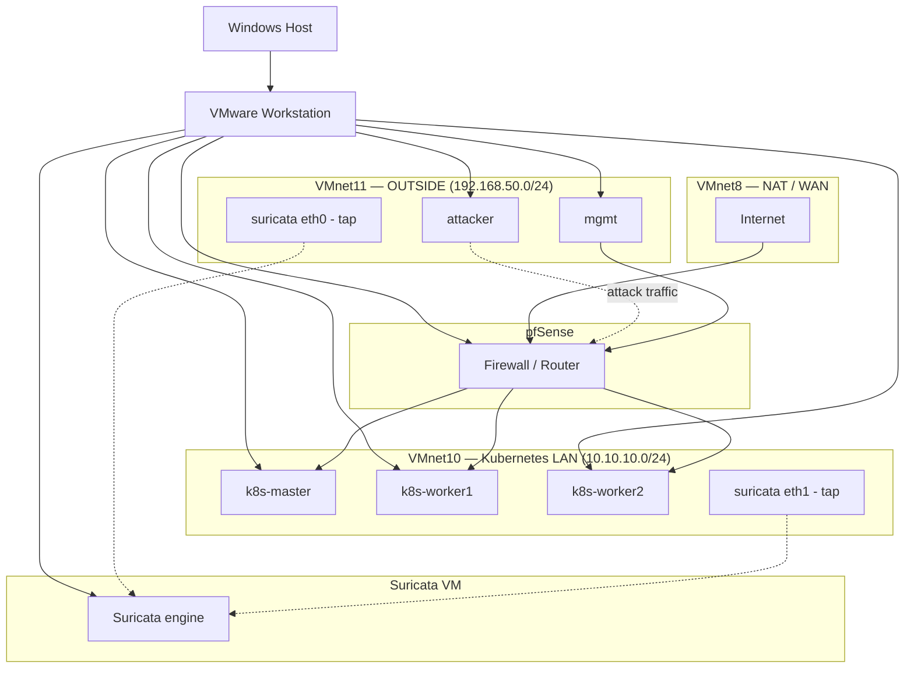

# network-security-lab

> A Suricata-based intrusion detection lab observing an existing Kubernetes networking environment from a security perspective, covering perimeter and lateral-movement detection, manual evidence correlation and IDS-to-IPS tuning.

This repository documents the design, deployment and validation of a network intrusion detection and investigation capability built on top of an existing lab environment. The project focuses on detection engineering, traffic analysis and manual incident correlation, following the same structured, phase-by-phase implementation approach used in the author's previous labs.

The environment is being built incrementally, with each phase documented and validated before the next is introduced. This repository documents only capabilities that have been implemented and validated in the lab.

This is the third project in a deliberate learning arc: [`zabbix-noc-lab`](https://github.com/paknaoo/zabbix-noc-lab) (build/monitor infrastructure) → [`k8s-cilium-lab`](https://github.com/paknaoo/k8s-cilium-lab) (build and observe Kubernetes networking) → `network-security-lab` (detect, investigate and respond to security incidents).

---

## Related Infrastructure

This lab observes infrastructure provisioned in a separate portfolio project, [k8s-cilium-lab](https://github.com/paknaoo/k8s-cilium-lab) — a production-inspired Kubernetes networking environment built with VMware Workstation, pfSense and Cilium. `network-security-lab` is deliberately a standalone repository: it treats the existing lab as a fixed target of observation rather than extending that project's scope.

| Host / Component | IP address | Role in this lab |
| --- | --- | --- |
| pfSense | `192.168.50.254` / `10.10.10.254` | Perimeter firewall between OUTSIDE and Kubernetes LAN |
| k8s-master | `10.10.10.20` | Observed target |
| k8s-worker1 | `10.10.10.21` | Observed target |
| k8s-worker2 | `10.10.10.22` | Observed target (powered on ad hoc) |
| mgmt | `192.168.50.10` | Management workstation |
| **suricata** (new) | `192.168.50.30` (eth0), `10.10.10.30` (eth1) | IDS engine, dual-tap |
| **attacker** (new) | `192.168.50.99` | North-south attacker VM |
| **attacker-pod** (new) | dynamic (Cilium IPAM) | East-west attacker pod |

---

## Architecture

The following diagram provides a high-level overview of the lab environment and its relationship to the existing Kubernetes networking lab.

> This diagram will be finalised in Phase 09 to reflect the fully implemented and validated lab. See [Phase 00 — Planning](docs/phase-00-planning.md) for the full architecture rationale and threat model.

---

## Project Goals

The project is designed to build practical experience with detection engineering and incident investigation while documenting each completed implementation phase.

- Deploy Suricata as a dual-tap IDS observing both perimeter (pre-firewall) and internal (post-firewall, east-west) traffic.
- Design and validate independent attack scenarios, each with a purpose-written detection rule.
- Practise manual, multi-source log correlation (Suricata, pfSense, Hubble) without SIEM assistance.
- Deepen understanding of harder Kubernetes networking mechanisms (BGP Control Plane v2, L2 Announcements) by observing their behaviour under attack conditions.
- Practise a full incident-response cycle, including handling a deliberate false positive.
- Deliberately and separately transition the IDS from pure detection to inline blocking (IPS), with documented rule-selection criteria.
- Maintain concise, reproducible infrastructure and investigation documentation suitable for a technical portfolio.

---

## Technology Stack

The following technologies are used throughout the project.

| Category | Technology |
| --- | --- |
| Operating System | Ubuntu Server 24.04 LTS |
| IDS / IPS Engine | Suricata (af-packet, multi-interface) |
| Ruleset | Emerging Threats Open (via `suricata-update`) + custom rules |
| Traffic Analysis | tcpdump, Wireshark, PCAP |
| Kubernetes Observability | Cilium Hubble (CLI and UI) |
| Perimeter Firewall | pfSense CE |
| Attacker Tooling | `nmap`, `curl`, `dig`, `hping3` (via `nicolaka/netshoot` for the pod-based attacker) |
| Correlation | Manual, cross-source (Suricata `eve.json`, pfSense logs, Hubble UI) — no SIEM |
| Source Control | Git and GitHub |

---

## Implemented Components

This section will be updated as each phase is completed and validated.

- [x] Phase 00 — Planning, architecture and threat model finalised.
- [ ] Phase 01 — Suricata IDS deployment.
- [ ] Phase 02 — Traffic analysis (tcpdump, Wireshark, PCAP, Hubble UI).
- [ ] Phase 03 — Five detection scenarios with custom rules.
- [ ] Phase 04 — Evidence correlation (pfSense + Suricata + Hubble UI).
- [ ] Phase 05 — Multi-event manual timeline reconstruction.
- [ ] Phase 06 — Full incident investigations, including a false positive.
- [ ] Phase 07 — IDS → IPS transition with rule tuning.
- [ ] Phase 09 — Final validation, architecture diagram, README, CV talking points.

Phase 08 (SIEM) is deliberately skipped — see [Phase 00 — Planning](docs/phase-00-planning.md#phase-08--skipped).

---

## Documentation

Implementation details are organised by project phase. Phases are listed in planned order; only completed phases are linked.

1. [Phase 00 — Planning](docs/phase-00-planning.md)

The detailed lessons-learned log, capturing concept-level takeaways as they are encountered, is maintained in:

- [Lessons Learned](docs/lessons-learned.md)

---

## Validation

Validation is grouped by phase and updated as each phase is completed.

Phase 00 is planning and research only and is not subject to formal validation — see [Phase 00 — Planning](docs/phase-00-planning.md).

Further phases will be added here as they are completed.

---

## Project Status

This project is **in progress**. Phase 00 (planning, architecture and threat model) is complete; implementation begins with Phase 01.

---

## Licence

This project is licensed under the MIT Licence. See the `LICENSE` file for details.
