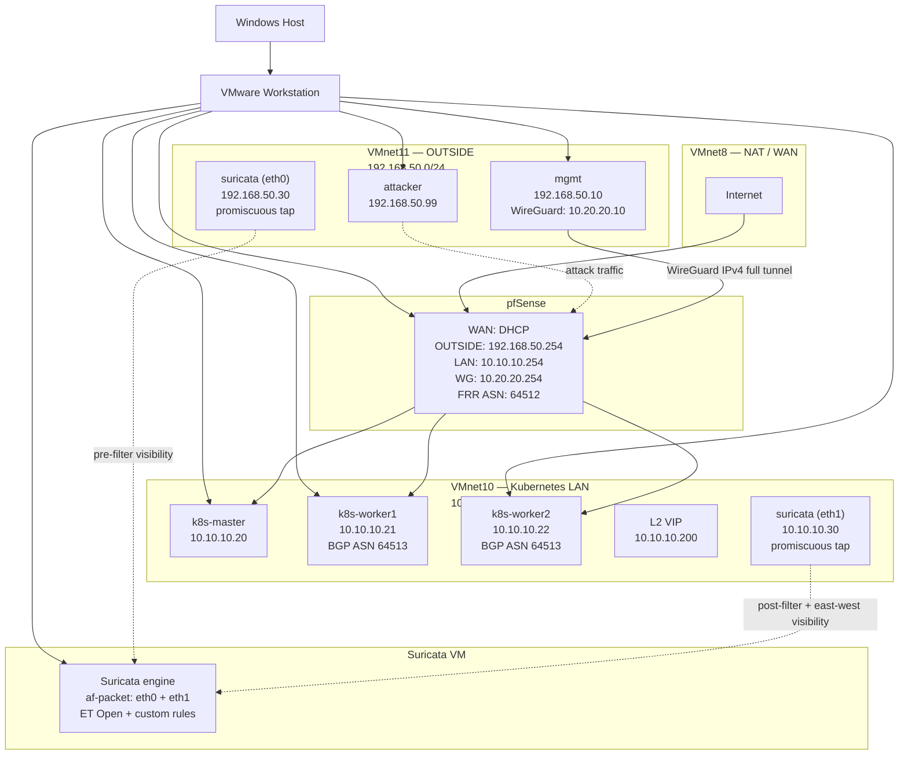

# Phase 00 — Planning

This document describes the planning, architecture and threat model for `network-security-lab` prior to any implementation. Unlike subsequent phases, Phase 00 is not subject to formal validation — it is planning and research only.

---

## Project Goal and Relationship to k8s-cilium-lab

`network-security-lab` is the third stage of a deliberate learning arc: [`zabbix-noc-lab`](https://github.com/paknaoo/zabbix-noc-lab) (build/monitor infrastructure) → [`k8s-cilium-lab`](https://github.com/paknaoo/k8s-cilium-lab) (build and observe Kubernetes networking) → `network-security-lab` (detect, investigate and respond to security incidents).

The project deliberately does not build a new environment from scratch — it uses the existing, fully validated `k8s-cilium-lab` infrastructure (pfSense, Kubernetes, Cilium, Hubble) as the target of observation from a security perspective. This continuity is intentional: it demonstrates work on a real, previously built environment rather than an artificially isolated lab created for a single project.

A secondary goal is closing gaps in understanding of the harder mechanisms from `k8s-cilium-lab` (BGP Control Plane v2, L2 Announcements) by observing their behaviour under attack and abnormal traffic conditions — something the first lab did not test (Phase 10 of `k8s-cilium-lab` explicitly excluded node, BGP and L2 failure testing from scope).

The scope is explicitly limited:

- The lab does not test attacks arriving from the internet through the pfSense WAN interface (the environment sits behind NAT with no real-world exposure).
- SIEM (Wazuh) was excluded due to host RAM budget constraints (32 GB) — correlation of Suricata/pfSense/Hubble logs is performed manually (Phases 04–06), which is also more instructive at this stage of learning than delegating correlation to an off-the-shelf tool.
- The IDS does not transition to IPS (auto-blocking) until the dedicated Phase 07 — Phases 01–06 operate in pure detection mode, so that learning detection is not conflated with learning blocking.

---

## Architecture Diagram

**Key points:**

- `attacker` connects toward pfSense OUTSIDE, but the traffic physically traverses the VMnet11 segment, where `suricata (eth0)` sits in promiscuous mode — so Suricata observes the attack attempt *before* pfSense makes an allow/deny decision.
- `suricata (eth1)` on VMnet10 sees what pfSense actually permitted through, plus node-to-node traffic (including Cilium VXLAN-encapsulated traffic).
- Suricata is a single VM running one engine process, with two independent listening interfaces configured via `af-packet` — not two separate Suricata instances.

---

## Threat Model

The lab tests two distinct attacker perspectives, corresponding to two different IDS vantage points.

### Scenario A — North-South (Perimeter)

- **Attacker:** dedicated `attacker` VM (`192.168.50.99`) on the OUTSIDE segment (VMnet11).
- **Assumption:** a host already present on the management segment — representing either a compromised machine on the administrative network, or an attacker who has bypassed the first layer of access control (for example, weak credentials or phishing against an admin's host). How the attacker got there is out of scope for this lab.
- **Target:** Kubernetes LAN resources (`10.10.10.0/24`) — k8s nodes, services exposed via L2/BGP VIP.
- **Visibility:** Suricata `eth0` (OUTSIDE, `192.168.50.30`) sees traffic *before* the pfSense decision — captures attack attempts regardless of whether they were blocked.
- **Techniques tested:** port scanning, HTTP recon, DNS queries, attempts to reach services blocked by pfSense.

### Scenario B — East-West (Lateral Movement)

- **Attacker:** `attacker-pod`, an ordinary unprivileged pod (no `hostNetwork`, no `privileged: true`, no additional capabilities), based on the `nicolaka/netshoot` image (includes `nmap`, `curl`, `dig`, `hping3`). Represents a realistic compromise-via-vulnerable-application scenario — the attacker inherits exactly the permissions the legitimate pod had, retaining its Cilium pod identity (important so that testing L3–L7 policies is meaningful).
- **Assumption:** the attacker already has code execution inside one of the namespaces — the question is how far it can move and what stops it.
- **Target:** other pods/services in the cluster, beyond the boundaries granted by CiliumNetworkPolicy.
- **Visibility:** Hubble (identity-aware, L3–L7) as the primary evidence source; Suricata `eth1` (LAN, `10.10.10.30`) as a supplementary source, with an explicit limitation — cross-node pod-to-pod traffic travels over VXLAN, so Suricata sees the encapsulated envelope, not raw L7 traffic.
- **Techniques tested:** cross-namespace connection attempts blocked by CiliumNetworkPolicy, correlation of "Cilium policy denied" with any corresponding Suricata alert.
- **Explicitly out of scope:** escalation from pod to node (for example, via a hostPath mount or a container runtime CVE) — a different attack vector, not tested in this lab.

### Explicitly Out of Scope (Overall)

- Attacks arriving from the internet through the pfSense WAN interface (environment sits behind NAT).
- Compromise of the Windows host itself or the VMware Workstation hypervisor layer.
- Attacks against WireGuard/pfSense as a target in themselves (WireGuard is a management channel here, not a tested defensive control).
- Attacker persistence (malware, backdoors) — the lab focuses on network traffic detection, not post-compromise host forensics.

---

## IDS Placement and Rationale

Suricata listens on two independent interfaces of a single engine (af-packet, multi-interface):

| Interface | Network         | Address         | Visibility                                                                  | Limitation                                                                                          |
| --------- | --------------- | --------------- | ---------------------------------------------------------------------------- | ----------------------------------------------------------------------------------------------------- |
| `eth0`    | VMnet11 OUTSIDE | `192.168.50.30` | Traffic *before* the pfSense decision — all attempts, including blocked ones | Does not see traffic purely internal to the LAN (east-west)                                           |
| `eth1`    | VMnet10 LAN     | `10.10.10.30`   | Traffic actually permitted by pfSense, plus node-to-node traffic             | Cross-node pod-to-pod traffic is encapsulated in VXLAN (UDP/8472) — Suricata sees the envelope, not the L7 payload, without additional decapsulation |

**Rationale:** a single tap (LAN only) would not allow correlating a Suricata alert with a pfSense block log, because a blocked packet never reaches the LAN segment. Two taps allow demonstrating the difference between "IDS in front of the firewall" (full visibility of attempts) and "IDS behind the firewall" (visibility of outcomes only) — a classic sensor-placement design discussion topic for interviews.

**Operating mode:** pure IDS (listen + alert) in Phases 01–06. Transition to IPS (inline blocking) only in Phase 07, as a deliberately separate stage.

---

## IP Plan

| Address / Network   | Purpose                | Notes                                                                                                                                  |
| ------------------- | ----------------------- | ---------------------------------------------------------------------------------------------------------------------------------------- |
| `192.168.50.0/24`   | VMnet11 OUTSIDE (existing) | gateway `192.168.50.254`                                                                                                            |
| `10.10.10.0/24`     | VMnet10 LAN (existing)  | gateway `10.10.10.254`                                                                                                                 |
| `10.20.20.0/24`     | WireGuard (existing)    | gateway `10.20.20.254`                                                                                                                 |
| `192.168.50.10`     | `mgmt` (existing)       | —                                                                                                                                       |
| `192.168.50.99`     | **`attacker`** (new)    | VM on OUTSIDE, represents the north-south attacker                                                                                     |
| `192.168.50.30`     | **`suricata` eth0** (new) | OUTSIDE tap, pre-filter visibility                                                                                                    |
| `10.10.10.30`       | **`suricata` eth1** (new) | LAN tap, post-filter + east-west visibility                                                                                          |
| —                   | **`attacker-pod`** (new) | No static IP — address dynamically assigned by Cilium IPAM at deployment time (lateral movement phase)                              |

No collisions identified against the addresses documented in `k8s-cilium-lab/docs/architecture.md` (`.10`–`.22`, `.200`, `.254` on both segments are accounted for; `.30` and `.99` are free on their respective segments).

---

## Resource Budget (RAM)

**Host: 32 GB**

| VM                              | RAM  | Status                          |
| -------------------------------- | ---- | -------------------------------- |
| pfSense                         | 1 GB | existing                        |
| mgmt                             | 2 GB | existing                        |
| k8s-master                      | 4 GB | existing                        |
| k8s-worker1                     | 4 GB | existing                        |
| k8s-worker2                     | 4 GB | existing (optional for daily work) |
| **suricata**                     | 4 GB | **new**                         |
| **attacker**                     | 1 GB | **new**                         |
| **Full total (everything running)** | **~20 GB** |                            |
| **Working total (without worker2)** | **~16 GB** | recommended for daily work |

Running everything (~20 GB) leaves ~12 GB for the Windows host, VMware Workstation and host-side tools (Wireshark, browser, IDE) — sufficient, but without a large margin. `worker2` is only needed for scenarios testing BGP/L2 failover or inter-worker load balancing — most of Phases 01–06 (Suricata, attacks, correlation) do not require the second worker, so the recommended daily working mode is without `worker2` (~16 GB), powering it on ad hoc where a scenario requires it.

Suricata is allocated 4 GB, above the typical minimum (2 GB is sufficient for lab-scale traffic) — the extra headroom covers af-packet buffers and local PCAP storage before trimming to evidence-relevant fragments.

---

## Phase Scope and Validation Criteria

Phase 00 (this document) is not subject to formal validation — it is planning/research only. Every subsequent phase ends with a validation section containing verifiable statements (in the style of `k8s-cilium-lab`) and a phase summary in the agreed format (goal → what was built → validation results → problems encountered and how resolved → lessons-learned entry).

### Phase 01 — Suricata IDS Deployment

**Goal:** stand up Suricata on a new Ubuntu Server 24.04 VM, in pure IDS mode (no auto-blocking), with two promiscuous listening interfaces.

**Scope:** install Suricata, configure af-packet on `eth0` (OUTSIDE) and `eth1` (LAN), enable promiscuous mode on both adapters (VMware level + guest OS level), install ET Open via `suricata-update`, basic validation that the engine starts and logs on both interfaces.

**Validation criteria:**

- Suricata service active and stable (`systemctl status suricata`).
- Both interfaces (`eth0`, `eth1`) visible in the af-packet configuration and accepting traffic (confirmed via packet counters in `eve.json`/stats).
- Generated test traffic (for example, ping) visible in logs on both interfaces independently.
- ET Open ruleset downloaded and loaded without syntax errors.
- Suricata NOT in inline/IPS mode — confirmed by configuration (`af-packet` in `copy-mode: none` or the IDS-only equivalent).

### Phase 02 — Traffic Analysis (tcpdump, Wireshark, PCAP, L3/L4/L7 + Hubble UI)

**Goal:** build practical fluency reading raw traffic (Suricata/tcpdump) and identity-aware traffic (Hubble), on the same traffic viewed from two perspectives.

**Scope:** capture and analyse reference traffic (for example, normal admin traffic mgmt→k8s, normal k8s workload traffic) via tcpdump/Wireshark on both Suricata taps, run Hubble UI in parallel (via the existing SSH tunnel from `k8s-cilium-lab`) on the same traffic, compare what is visible from each side.

**Validation criteria:**

- Reference PCAP captured on `eth0` and `eth1` with correctly interpreted L3/L4/L7 layers.
- Hubble UI shows corresponding flows for the same traffic in the same time window.
- Documented visibility difference — a concrete example of traffic Hubble interprets at the identity/L7 level that Suricata's LAN tap sees only as encapsulated VXLAN.
- Evidence-relevant PCAP fragments stored under `snapshots/phase-02/`.

### Phase 03 — Five Detection Scenarios

**Goal:** implement and validate five independent attack scenarios, each with its own purpose-written Suricata rule (custom, supplementing ET Open).

**Scope:** scripts under `scripts/attacks/` for: (1) port scan, (2) HTTP recon/attack, (3) suspicious DNS traffic, (4) an attempt blocked by pfSense, (5) an attempt blocked by CiliumNetworkPolicy — the last one correlated simultaneously via Suricata, pfSense and Hubble UI.

**Validation criteria (per scenario, x5):**

- Attack script runs deterministically and repeatably.
- Custom Suricata rule generates an alert in `eve.json` with correct `sid`/`classtype`/`priority`.
- Scenario 4: pfSense log confirms the block with the same timestamp/5-tuple as the Suricata alert on the OUTSIDE tap.
- Scenario 5: Hubble shows `Policy denied`; Suricata (LAN tap, with the VXLAN caveat) and the pfSense log correlate into a consistent timeline.
- Evidence fragments (PCAP + `eve.json` + Hubble UI screenshot) stored under `snapshots/phase-03/`.

### Phase 04 — Evidence Correlation (pfSense + Suricata + Hubble UI)

**Goal:** build a consistent, manual correlation workflow across three independent evidence sources for a single event.

**Scope:** select one scenario from Phase 03 (ideally #5), fully reconstruct "who saw what and when" using Hubble UI's service map, flow visibility and policy verification.

**Validation criteria:**

- Event timeline reconstructed to second-level accuracy, consistent across all three sources.
- Visibility discrepancies (for example, something Hubble sees that Suricata does not, due to VXLAN) explicitly documented, not omitted.
- Hubble UI service map confirms the expected traffic topology for the analysed event.

### Phase 05 — Log Correlation, Manual Timeline Reconstruction

**Goal:** extend Phase 04 to a multi-event, longer time window — simulating a real investigation rather than a single incident.

**Scope:** generate a sequence of several distinct events (a mix of Phase 03 scenarios) spread over time, manually reconstruct the full timeline from logs without SIEM assistance.

**Validation criteria:**

- Timeline covering all generated events, in correct chronological order, with each point referencing a specific log entry/PCAP as evidence.
- Documented time/effort of manual correlation as a reference point for discussing "why SIEM helps at scale" (despite being deliberately excluded here).

### Phase 06 — Full Incident Investigations (2–3 cases + false positive)

**Goal:** practise a complete IR cycle (identification → analysis → conclusions) on complex, multi-stage cases, including one false positive.

**Scope:** 2–3 scenarios combining several techniques at once (for example, recon → lateral movement attempt), plus one deliberately designed false positive (legitimate traffic that looks suspicious) to practise tuning.

**Validation criteria (per case):**

- Written incident report in a format resembling a real IR report (what happened, how it was detected, impact, recommendation).
- For the false positive: root cause identified, a rule/threshold change proposed and tested that reduces the false alarm without losing detection of the genuine threat.

### Phase 07 — IDS → IPS Transition with Rule Tuning

**Goal:** deliberately and controllably switch Suricata from detection mode to inline blocking, with justification for which rules qualify for auto-blocking.

**Scope:** change af-packet mode to inline (NFQUEUE or equivalent), select a low-false-positive-risk subset of rules for `drop` mode, keep the remaining rules in `alert` mode.

**Validation criteria:**

- Suricata operates inline, confirmed by capturing traffic actually blocked (not merely alerted) from one of the Phase 03 scenarios.
- Reference legitimate traffic from Phase 02 still passes without disruption after switching to IPS (regression checked).
- Documented criteria for the "this rule → drop, that rule → alert only" decision.

### Phase 08 — Skipped

SIEM (Wazuh) was deliberately excluded from scope due to host RAM budget constraints — see [Project Goal and Relationship to k8s-cilium-lab](#project-goal-and-relationship-to-k8s-cilium-lab) above.

### Phase 09 — Final Validation, Architecture Diagram, README, CV Talking Points

**Goal:** close out the repository as a coherent, portfolio-ready project.

**Scope:** full re-validation of all previous phases (analogous to `make validate` in `k8s-cilium-lab`, if a similar aggregate script is warranted), final architecture diagram, README modelled on `k8s-cilium-lab`, a section with CV/interview talking points.

**Validation criteria:**

- All scripts under `scripts/attacks/` run without syntax errors (analogous to `make syntax`/`make lint`).
- All evidence snapshots present and complete for Phases 01–07.
- `docs/lessons-learned.md` contains an entry for every planned concept (VXLAN encapsulation, ET Open vs. custom rules, pre- vs. post-filter IDS placement, IDS→IPS tuning, manual correlation vs. SIEM, etc.).
- README complete and stylistically consistent with `k8s-cilium-lab`.
