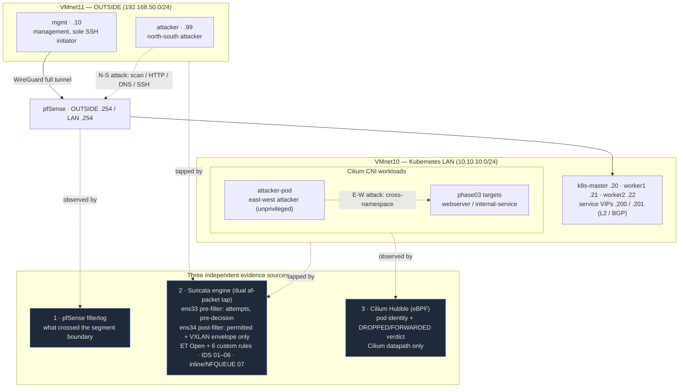

# Phase 08 — Final Validation, Architecture Diagram, README, CV Talking Points

This phase closes out the repository as a coherent, portfolio-ready project: a full re-validation of all previous phases, a final as-built architecture diagram, a README consistent with the earlier labs, and a set of CV/talking points.

(SIEM — originally a candidate for its own phase — was deliberately excluded from scope due to host RAM budget constraints; see [Phase 00](phase-00-planning.md#project-goal-and-relationship-to-k8s-cilium-lab). The phase numbering runs 00–08 with no gap.)

---

## As-Built Architecture Diagram

The [Phase 00 diagram](phase-00-planning.md#architecture-diagram) shows the environment as planned. The diagram below shows it as built and validated — in particular, where each of the three independent evidence sources actually observes traffic, and the two attacker vantage points that were tested.

**What the diagram makes explicit (all validated in earlier phases):**

- **Three independent, non-overlapping evidence sources.** pfSense sees traffic crossing the segment boundary; Suricata sees everything on the wire at its two taps (but only the VXLAN envelope for cross-node pod traffic); Hubble sees pod identity and policy verdicts (but only for traffic on Cilium's datapath). No single source sees everything — the core finding of Phases 04–05.
- **Two attacker vantage points.** The `attacker` VM drives north-south tests from OUTSIDE; `attacker-pod` drives east-west lateral-movement tests from inside the cluster.
- **The dual-tap placement.** `ens33` (pre-filter) captures attempts regardless of whether pfSense blocks them; `ens34` (post-filter) captures what was permitted, plus east-west node-to-node traffic.

---

## Final Re-Validation

Every prior phase was re-checked against its own validation criteria and against the live repository state. Results:

| Phase | Criterion | Result |
| --- | --- | --- |
| 01 | Service active; dual `af-packet` interfaces; ET Open loaded; pure IDS mode | **Pass** — all evidence present in `snapshots/phase-01/` |
| 02 | Reference PCAP on both taps; Hubble parallel view; documented visibility gap | **Pass** — `snapshots/phase-02/` (7 files) |
| 03 | Five scenarios; six custom signatures with correct metadata; ET Open co-firing | **Pass** — `snapshots/phase-03/` (15 files) |
| 04 | Second-level timeline across sources; visibility discrepancies documented | **Pass** — `snapshots/phase-04/` (service-map screenshots); timelines in the phase doc |
| 05 | Multi-event timeline; signal/noise separation; manual-effort documented | **Pass** — `snapshots/phase-05/` (4 files) |
| 06 | Written IR report per case; false-positive root cause + tested fix | **Pass** — three reports under `docs/incident-reports/` |
| 07 | Inline operation confirmed; real blocking; regression checked; drop/alert criteria | **Pass** — `snapshots/phase-07/` (3 files) |

**Validation criteria, as originally stated in Phase 00, and their honest status:**

- **"All scripts under `scripts/attacks/` run without syntax errors."** The one committed script (`scenario-01-portscan.sh`) passes `bash -n`. The remaining scenarios (HTTP recon, DNS, pfSense-blocked SSH, CiliumNetworkPolicy-blocked lateral movement, and the Phase 05 multi-event sequence) were executed as documented ad-hoc commands rather than committed scripts — their exact commands are recorded in the respective phase docs. This is a deliberate scope note, not a silent omission: the repository documents the attacks inline rather than as a scripted test harness, and the single committed script is the representative, reproducible example.
- **"All evidence snapshots present and complete for Phases 01–07."** Present for every phase that produced its own evidence. **Phase 06 has no `snapshots/` directory by design** — the two incident investigations are analyses built on Phase 05's evidence (which they cite as `snapshots/phase-05/`), and Case 3's root-cause analysis also draws on Phase 05 data, so there was no new evidence to capture. This is expected, not a gap.
- **"`docs/lessons-learned.md` contains an entry for every planned concept."** All planned concepts are covered. The pre- vs. post-filter IDS placement concept — named in Phase 00 but previously only implicit in the architecture docs — was given its own distilled entry in this phase (see below).
- **"README complete and stylistically consistent with `k8s-cilium-lab`."** The README was finalised in this phase: the as-built diagram replaces the placeholder in the Architecture section, and a CV/talking-points section was added.

---

## CV Talking Points

A short, factual set of talking points drawn from what the lab actually demonstrates — each tied to concrete, committed evidence rather than claims:

- **Deployed a dual-tap Suricata IDS** (v8.0.6, `af-packet`) positioned to observe traffic both before and after a pfSense firewall decision, demonstrating the classic pre- vs. post-filter sensor-placement trade-off with captured evidence from both vantage points.
- **Wrote and tuned six custom Suricata signatures** supplementing ET Open, including a full false-positive tuning cycle (root cause → rule revision → live before/after validation) that eliminated a 10/11 false-positive rate without losing true-positive detection.
- **Performed manual, multi-source incident correlation** across three independent evidence sources (pfSense, Suricata, Cilium Hubble) without a SIEM — reconstructing second-level timelines and quantifying the analyst effort this takes, as a concrete argument for correlation automation at scale.
- **Diagnosed a real, self-inflicted production-style incident** (two conflicting CiliumNetworkPolicies on a shared pod, overlapping in time with a genuine L2-announcement infrastructure fault) by systematic hypothesis elimination across ARP, firewall state, packet capture, and eBPF flow logs.
- **Transitioned an IDS to inline IPS** (NFQUEUE) on an isolated path, confirming real packet blocking with documented drop-vs-alert rule-qualification criteria, while keeping the production IDS and management access untouched.
- **Documented the entire project phase-by-phase** with a consistent validation discipline — including programmatic verification of every quoted figure, and explicit acknowledgement of limitations and corrections rather than silent cleanup.

---

## Lessons Learned Entry

The following entry was added to [`docs/lessons-learned.md`](lessons-learned.md), closing the one Phase 00 concept not previously distilled:

**Topic: Pre-filter vs. post-filter IDS placement answers two different questions — "what was attempted" vs. "what got through" — and a single tap can only answer one.**

Previously unclear: whether sensor placement relative to the firewall is a detail or a design decision with real consequences for what evidence exists after an incident.

What the exercise revealed: the OUTSIDE tap (`ens33`, pre-filter) recorded every attack attempt regardless of whether pfSense blocked it — which is what let a blocked SSH attempt still be correlated against the pfSense block log. The LAN tap (`ens34`, post-filter) only ever saw what the firewall permitted, plus east-west traffic the perimeter never touches. A blocked packet never reaches the LAN segment, so a LAN-only sensor would have no record of the attempt at all.

Takeaway: an IDS in front of the firewall answers "what was attempted"; one behind it answers "what got through". These are different investigative questions, and which one a sensor can answer is fixed by where it sits — not something that can be tuned later in software.
